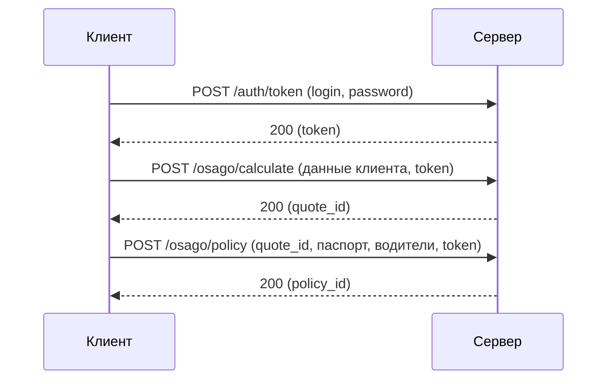

# API ОСАГО — расчёт котировки и создание договора

> **Тип документа:** API-документация  
> **Аудитория:** Разработчики, аналитики, QA-инженеры  
> **Автор:** Оточина Анастасия  
> **Опыт:** Ведущий специалист группы поддержки ПО, Абсолют Технологии (2024–2025 гг.)  

---

## Содержание

1. [Обзор](#обзор)
2. [Аутентификация](#аутентификация)
3. [Расчёт котировки](#расчёт-котировки)
4. [Создание договора](#создание-договора)
5. [Коды ошибок](#коды-ошибок)

---

## Обзор

Описываемое API предоставляет методы для расчёта котировки и создания договора ОСАГО на основе котировки. Документ покрывает три метода: получение токена аутентификации (POST), расчёт котировки (POST) и создание договора (POST).

**Базовый URL:** `https://api.example.ru/osago/v1`

**Формат данных:** все запросы и ответы передаются в формате JSON (`Content-Type: application/json`).

**Формат дат:** все даты передаются в формате ISO 8601 (`YYYY-MM-DD`).



---

## Аутентификация

### Получение токена

`POST /api/v1/auth/token`

| Параметр | Тип | Обязательный | Описание |
|----------|-----|--------------|----------|
| login | string | Да | Учётная запись, выданная при предоставлении доступа к тестовой среде |
| password | string | Да | Пароль учётной записи |

### Пример запроса

```json
{
  "login": "test_user",
  "password": "test_password"
}
```

### Пример успешного ответа (200)

```json
{
  "token": "eyJhbGciOiJIUzI1NiIsInR5cCI6IkpXVCJ9...",
  "expires_in": 3600
}
```

| Поле | Тип | Описание |
|------|------|----------|
| token | string | Bearer-токен для авторизации в последующих запросах |
| expires_in | integer | Время жизни токена в секундах. По умолчанию — 3600 (1 час) |

### Использование токена

Токен передаётся в заголовке всех последующих запросов:

```
Authorization: Bearer <token>
```

Если токен истёк — сервер вернёт `401`. Необходимо повторно выполнить запрос `POST /api/v1/auth/token`.

---

## Расчёт котировки

### Описание

Метод выполняет расчёт котировки на основе передаваемых данных клиента. Возвращает ID котировки, её статус и размер премии.

### Запрос
`POST /api/v1/osago/calculate`

### Параметры запроса

| Параметр | Тип | Обязательный | Описание |
|----------|-----|--------------|----------|
| insured_last_name | string | Да | Фамилия застрахованного лица |
| insured_first_name | string | Да | Имя застрахованного лица |
| insured_middle_name | string | Нет | Отчество застрахованного лица |
| insured_birth_date | date | Да | Дата рождения застрахованного лица |
| vehicle_mark | string | Да | Марка транспортного средства |
| vehicle_model | string | Да | Модель транспортного средства |
| vehicle_manufactured_year | integer | Да | Год выпуска транспортного средства |
| vehicle_vin | string | Да | VIN транспортного средства (17 символов) |
| vehicle_power | integer | Да | Мощность транспортного средства, л.с. |
| vehicle_registration_number | string | Да | Государственный номер транспортного средства |
| drivers_limit | boolean | Да | Ограничение количества водителей (true — ограничено, false — без ограничений) |
| policy_period_start | date | Да | Дата начала действия полиса страхования |
| policy_period | integer | Да | Срок действия полиса страхования, мес. (3, 6, 9, 12) |

### Пример запроса

```json
{
  "insured_last_name": "Петров",
  "insured_first_name": "Иван",
  "insured_middle_name": "Васильевич",
  "insured_birth_date": "1993-01-15",
  "vehicle_mark": "Toyota",
  "vehicle_model": "Camry",
  "vehicle_manufactured_year": 2015,
  "vehicle_vin": "4T1BZ1HK6FU012345",
  "vehicle_power": 149,
  "vehicle_registration_number": "И248КС77",
  "drivers_limit": true,
  "policy_period_start": "2026-12-31",
  "policy_period": 12
}
```

### Пример успешного ответа (200)

```json
{
  "quote_id": 245566789,
  "quote_status": "created",
  "premium": 7549.2
}
```

### Поля ответа

| Поле | Тип | Описание |
|------|------|----------|
| quote_id | integer | Уникальный идентификатор котировки. Используется при создании договора |
| quote_status | string | Статус котировки. Возможные значения: `created` — котировка создана, `expired` — срок действия котировки истёк (по умолчанию 24 часа с момента создания) |
| premium | number | Размер страховой премии в рублях |

### Коды ответов

| Код | Значение | Описание |
|-----|----------|----------|
| 200 | — | Котировка рассчитана успешно |
| 400 | `VALIDATION_ERROR` | Неверный формат запроса или отсутствуют обязательные параметры |
| 401 | `UNAUTHORIZED` | Токен не передан, недействителен или истёк |
| 500 | `INTERNAL_ERROR` | Внутренняя ошибка сервера |

---

## Создание договора

### Описание

Метод выполняет создание договора ОСАГО на основе quote_id из расчёта, а также дополнительно передаваемых данных (документ страхователя, список водителей). Возвращает ID договора, его статус и номер полиса.

### Запрос
`POST /api/v1/osago/policy`

### Параметры запроса

| Параметр | Тип | Обязательный | Описание |
|----------|-----|--------------|----------|
| quote_id | integer | Да | ID котировки |
| insured_document_type | string | Да | Тип документа застрахованного лица. Возможные значения: passport |
| insured_document_series | string | Да | Серия документа застрахованного лица (4 цифры) |
| insured_document_number | string | Да | Номер документа застрахованного лица (6 цифр) |
| drivers | array | Да, если drivers_limit = true | Данные о водителях, допущенных до управления транспортным средством |

### Структура объекта `drivers`

| Параметр | Тип | Обязательный | Описание |
|----------|-----|--------------|----------|
| last_name | string | Да | Фамилия водителя |
| first_name | string | Да | Имя водителя |
| middle_name | string | Нет | Отчество водителя |
| birth_date | date | Да | Дата рождения водителя |
| driving_experience_years | integer | Да | Стаж вождения в годах |
| license_number | string | Да | Номер водительского удостоверения |

### Пример запроса

```json
{
  "quote_id": 245566789,
  "insured_document_type": "passport",
  "insured_document_series": "4525",
  "insured_document_number": "121315",
  "drivers": [
    {
      "last_name": "Петров",
      "first_name": "Иван",
      "middle_name": "Васильевич",
      "birth_date": "1993-01-15",
      "driving_experience_years": 7,
      "license_number": "77АА123456"
    }
  ]
}
```

### Пример успешного ответа (200)

```json
{
  "policy_id": 901125325,
  "policy_status": "created",
  "policy_number": "ААА 0123456789"
}
```

### Поля ответа

| Поле | Тип | Описание |
|------|------|----------|
| policy_id | integer | Уникальный идентификатор договора в системе |
| policy_status | string | Статус договора. Возможные значения: `created` — договор создан, `declined` — договор отклонён (например, котировка истекла) |
| policy_number | string | Номер полиса ОСАГО. Не возвращается, если policy_status = declined |

### Коды ответов

| Код | Значение | Описание |
|-----|----------|----------|
| 200 | — | Договор создан успешно |
| 400 | `VALIDATION_ERROR` | Неверный формат запроса или отсутствуют обязательные параметры |
| 401 | `UNAUTHORIZED` | Токен не передан, недействителен или истёк |
| 404 | `QUOTE_NOT_FOUND` | Котировка с указанным `quote_id` не найдена |
| 404 | `QUOTE_EXPIRED` | Срок действия котировки истёк — необходимо рассчитать новую |
| 409 | `POLICY_ALREADY_EXISTS` | Договор для данной котировки уже создан |
| 500 | `INTERNAL_ERROR` | Внутренняя ошибка сервера |

---

## Коды ошибок

### Общие коды ошибок

| Код | Значение | Описание |
|-----|----------|----------|
| 400 | `VALIDATION_ERROR` | Неверный формат запроса или отсутствуют обязательные параметры. В поле `message` указано, какое поле вызвало ошибку |
| 401 | `UNAUTHORIZED` | Токен не передан, недействителен или истёк |
| 404 | `QUOTE_NOT_FOUND` | Котировка с указанным `quote_id` не найдена |
| 404 | `QUOTE_EXPIRED` | Срок действия котировки истёк — необходимо рассчитать новую |
| 409 | `POLICY_ALREADY_EXISTS` | Договор для данной котировки уже создан |
| 500 | `INTERNAL_ERROR` | Внутренняя ошибка сервера. Рекомендуется повторить запрос через несколько минут |

### Пример ответа с ошибкой 400

```json
{
  "error": "VALIDATION_ERROR",
  "message": "Поле 'vehicle_vin' обязательно для заполнения"
}
```

### Пример ответа с ошибкой 401

```json
{
  "error": "UNAUTHORIZED",
  "message": "Токен недействителен или истёк"
}
```

### Пример ответа с ошибкой 404

```json
{
  "error": "QUOTE_NOT_FOUND",
  "message": "Котировка с ID 245566789 не найдена"
}
```

### Пример ответа с ошибкой 409

```json
{
  "error": "POLICY_ALREADY_EXISTS",
  "message": "Договор для котировки 245566789 уже создан"
}
```

> Код 500 не возвращает структурированное тело ошибки. При получении 500 рекомендуется повторить запрос. Если ошибка повторяется — обратиться в техподдержку.

---

## О документе

Документ составлен на основе работы с API страхового продукта в Абсолют Технологии (2024–2025 гг.). Имена полей и структура приведены в упрощённом виде — по причине NDA.

**Автор:** Оточина Анастасия  
**Контакт:** larnia@list.ru  
**GitHub:** [профиль](https://github.com/irishsun/tech_writing/tree/main)
